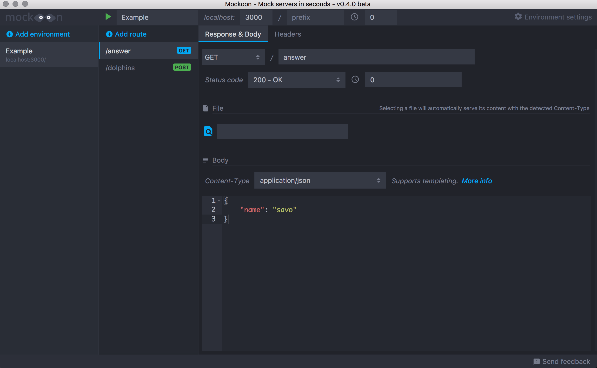

# Mock 数据

在前后端分离盛行的今天，mock 是必不可少的，下面介绍两种简单的 mock 方式

1. [json-server](<https://github.com/typicode/json-server>) - 30s 搭建自己的 Restful API
2. [mockoon](https://github.com/255kb/mockoon) - 几秒搭建 mock server

## JSON-SERVER
30s 搭建你的 RESTFUL mock api

### 安装 json-server

```bash
npm install json-server -g
```

### 配置 json 文件
项目中新建 `mock` 文件夹，个人习惯放在最外层

新建 `db.json` 文件

填入以下内容：
```json
{
  "posts": [
    { "id": 1, "title": "json-server", "author": "typicode" }
  ],
  "comments": [
    { "id": 1, "body": "some comment", "postId": 1 }
  ],
  "profile": { "name": "typicode" }
}
```

### 配置启动 script
在 `package.json` 中添加一行 script

```json
  "scripts": {
    "mock": "json-server --watch ./mock/db.json"
  }
```

```bash
npm run mock
```

mock 服务默认会启动在 3000 端口，访问 <http://localhost:3000> 可以看到启动页面

访问：

<http://localhost:3000/posts/1> 

<http://localhost:3000/comments/1>

<http://localhost:3000/profile>

即可看到 mock 的数据
### 配置代理

由于本地开发和 mock 服务端口不一致产生的跨域，可以配置本地代理，下面是简单的配置：
```js
    proxyTable: {
      '/mock': {
        target: 'http://localhost:3000',
        changeOrigin: true,
        pathRewrite: {
          '^/v1/mock': '/' // rewrite path
        }
      }
    }
```

详细配置可以参考：[本地代理](/docs/configs/proxy.md)

更多用法请参考官方文档

## MOCKOON

这个是最近才发现的一个工具，基于 ts 写的 PC 客户端软件，很像 Postman 的风格，鼠标点点就可以启动 mock server 啦~

### 截图


### 缺点

该项目目前正处于开发阶段，还不支持导入导出配置文件，所以你写的 mock 没有办法跟团队成员共享。

而 `json-server` 只需要把配置文件加到版本管理即可与团队成员共享